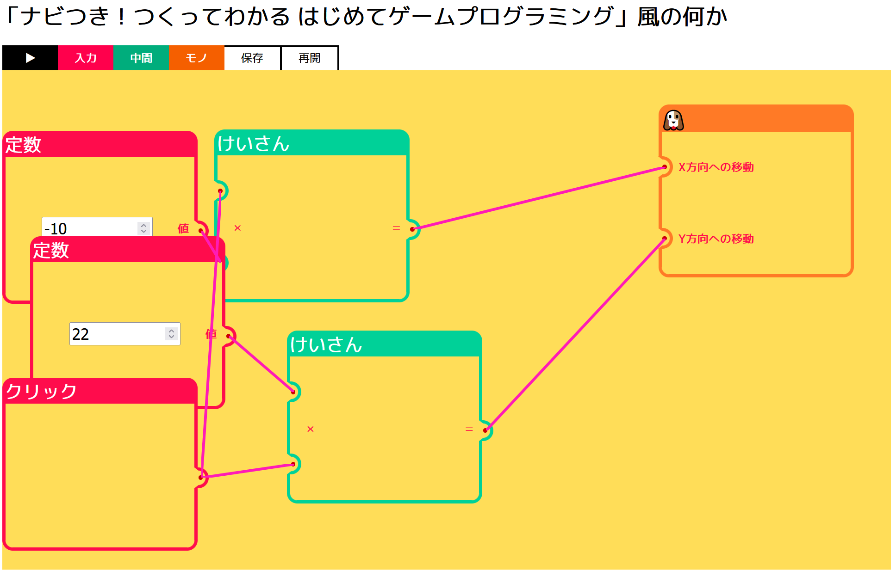

# web-components-verton

任天堂の「ナビつき！ つくってわかる はじめてゲームプログラミング」っぽく作ったアプリ

## テスト用に作ったサンプルアプリ

- [1-constant,click,calculate,dog.json](https://github.com/igrep/web-components-verton/raw/main/test-vertexes/1-constant%2Cclick%2Ccalculate%2Cdog.json)
    - クリックする毎に🐶が左斜め下に動くだけ
- [2-whilePointerDown,division,cat.json](https://github.com/igrep/web-components-verton/raw/main/test-vertexes/2-whilePointerDown%2Cdivision%2Ccat.json)
    - マウスボタンを押している間、😺がマウスカーソルの動きに合わせてゆっくりめに動くだけ
- [3-lastPosition,subtraction,person.json](https://github.com/igrep/web-components-verton/raw/main/test-vertexes/3-lastPosition%2Csubtraction%2Cperson.json)・[4-lastPosition,addition,subtraction,person.json](https://github.com/igrep/web-components-verton/raw/main/test-vertexes/4-lastPosition%2Caddition%2Csubtraction%2Cperson.json)
    - マウスカーソルに合わせて🙂が動く。カーソルが動いていない間もちょっとずつ🙂が動くだけ
- [5-constant,equal,and,dog.json](https://github.com/igrep/web-components-verton/raw/main/test-vertexes/5-constant%2Cequal%2Cand%2Cdog.json)
    - 200フレーム後に🐶が200px右に動くだけ
- [6-less-than,counter-increment,not,and,person.json](https://github.com/igrep/web-components-verton/raw/main/test-vertexes/6-less-than%2Ccounter-increment%2Cnot%2Cand%2Cperson.json)
    - 4秒間🙂が下に動いた後左に動くだけ
- [7-comparisons.json](https://github.com/igrep/web-components-verton/raw/main/test-vertexes/7-comparisons.json)
    - マウスを押した数に応じて🐶🙂😺が右に動くだけ:
        - 1～5回目は🐶が動く
        - 5回目以降は😺が動く
        - 6回目以降は🙂が動く
- [8-comparisons2.json](https://github.com/igrep/web-components-verton/raw/main/test-vertexes/8-comparisons2.json)
    - マウスを押した数に応じて😺が動くだけ:
        - 1～3回目は左に動く
        - 4回目以降は上に動く
